<picture>
  <source media="(prefers-color-scheme: dark)"  srcset="./assets/header-neon-dark.svg">
  <source media="(prefers-color-scheme: light)" srcset="./assets/header-neon-light.svg">
  
</picture>

&nbsp;&nbsp;&nbsp;&nbsp;

I build web apps end to end, and I turn what I learn into something you can click.

That habit turned into a set of interactive course sites. When I could not find a good
explanation of how an AI agent works, I built one that shows the `messages` array
growing in real time. Same for data structures, algorithms, Redis, TypeScript, and APIs.

**Open to frontend / full-stack roles — new grad through mid-level — in the SF Bay Area or Irvine, CA.**

---

### Things I've shipped

**[AgentTape](https://agenttape.vercel.app)** · replay a Claude Code session that already happened

Drop a transcript on the page and step through the run: the messages array as it grew, the one
step that blew up the context, and whether that payload is still being re-sent every turn since.
Parsing happens entirely in the browser — no upload, no account, no backend that receives
transcript content. `agenttape check` reads a rule set instead — search before write, a context
ceiling, no tool called five times in a row — and **exits non-zero when a run breaks one**, so it
sits in CI and tells you the day your agent's behaviour changed.

`Next.js 15` `TypeScript` `Canvas` `DevTools Protocol` — 3 dependencies · [live](https://agenttape.vercel.app) · [repo](https://github.com/renrenmimi/AgentTape)

**[PetNote](https://petnote.vercel.app)** · pet-centric social app, multi-owner by design

Two people can co-manage one pet profile, which is where most of the difficulty is. Account
deletion writes a TTL tombstone, so a second open tab cannot bring the profile back. Counters
carry a `counted` flag and cannot go below zero. Invite codes are re-validated inside the
transaction, so two people redeeming the same code cannot both succeed.

`React 19` `Firebase` `Cloud Functions` `Tailwind 4` — 200+ commits · [live](https://petnote.vercel.app) · [repo](https://github.com/renrenmimi/PetNote)

**[ToneDown](https://tone-down.vercel.app)** · a live tone coach for heated conversations

Acoustic and semantic signals combined into one score every two seconds. The reducer never calls
`Date.now()`; every transition reads the timestamp off a `TICK` event instead, which is what lets
the demo replay from a script and keeps its 100+ tests deterministic. Falls back from
Groq Whisper to Web Speech to raw loudness, so it still works with the network off.

`React` `TypeScript` `Groq` `Vitest` `Playwright` · [demo](https://tone-down.vercel.app/demo) · [repo](https://github.com/renrenmimi/ToneDown)

**[GreenLane](https://greenlane-beryl.vercel.app)** · immigration timeline tracker

Ten years of visa bulletin history, wait-time estimates, and email alerts when a category moves.
The data comes from 130 US visa bulletins and 424 Canadian Express Entry draws, refreshed by a
scheduled job every morning.

`Next.js 15` `SSR` `Python` `GitHub Actions` · [live](https://greenlane-beryl.vercel.app) · [repo](https://github.com/renrenmimi/greenlane)

**[KOVA Flooring](https://www.kovaflooring.com)** · brand site and dealer portal, shipped for a client

The public brand site is statically exported, so there is no server to
run and Firebase never reaches the public bundle. Behind a login sits a dealer portal where each
dealer sees pricing for their own tier next to live inventory, plus an admin console for editing
price per product per tier and importing stock by CSV.

`Next.js 15` `Static Export` `Firebase Auth` `Firestore` `Cloudflare` · [live](https://www.kovaflooring.com)

**[Repo Time Machine](https://repo-time-machine.vercel.app)** · a playable history of a public GitHub repository

Paste a repository URL and watch its default branch grow commit by commit. File trees are rebuilt
from checkpoints and diffs, with exact and reconstructed states labelled separately. The GitHub
token stays on the server, and a synthetic 16-commit demo runs without spending GitHub quota.

`Next.js 16` `TypeScript` `GitHub REST API` `Vitest` `Playwright` · [live](https://repo-time-machine.vercel.app) · [repo](https://github.com/renrenmimi/RepoTimeMachine)

**[iCanDoIt](https://github.com/renrenmimi/iCanDoIt)** · a native macOS day planner

Attach a reward to each task; clear them all and the app throws confetti. Built with SwiftUI and
SwiftData as a plain Swift package. Two hidden flags do the testing: `--snapshot` renders every
screen offscreen to PNG without asking for screen-recording permission, and `--selftest` asserts
what screenshots can't prove, like drag-and-drop placement and schema backfill.

`SwiftUI` `SwiftData` · [repo](https://github.com/renrenmimi/iCanDoIt)

### Learning tools I built

Interactive courses and practice tools, with progress kept in the browser where applicable.

| | |
|---|---|
| [**DataData**](https://data-data.vercel.app) | 14 chapters of data structures: memory diagram first, then animation, then Java/Python/JS side by side |
| [**AlgoAlgo**](https://algo-algo.vercel.app) | 13 chapters of algorithms: decision trees, DP tables and binary-search intervals replayed step by step |
| [**APIer**](https://apier-eta.vercel.app) | HTTP → REST → GraphQL, with exercises that call live public APIs |
| [**TSer**](https://tser.vercel.app) | 12 chapters of TypeScript, with compiler errors quoted from actual `tsc` output |
| [**RedisVisual**](https://redis-visual.vercel.app) | Redis data structures, caching patterns, operations and review questions in seven stops |
| [**DrillLab**](https://drill-lab-three.vercel.app) | four practice tracks that gradually remove scaffolding, from review questions to timed builds |
| [**AgentLab**](https://agent-lab-blond.vercel.app) | a visual introduction to message history, tool calls and the agent loop |
| [**Bug&nbsp;Museum**](https://bugmuseum.vercel.app) | six anonymized cases: reproduce the failure, compare fixes and run the regression test |
| [**SwiftLab**](https://renrenmimi.github.io/SwiftLab/) | takes iCanDoIt apart and rebuilds it, starting from one line of Hello world |

AgentLab's responses are recorded in `lib/scenario.ts`, so it runs without an API key. Each
wrong answer in its exercises comes with an explanation of why it is wrong.

### Games and experiments

**[CyberFan](https://renrenmimi.github.io/CyberFan/)** — four cartoon appliances drawn in
1940s cel style, with working gears and no audio files: every sound is oscillators and
filtered noise, and the airflow is aimed at the camera instead of across it.

**[Renren Across Tabs](https://renrenmimi.github.io/renren-across-tabs/)** — open multiple browser
rooms and send a cartoon Renren from one tab to another. No account, no backend — just browser
tabs talking.

**[Avatar Dash](https://renrenmimi.github.io/avatar-dash/)** — a small platformer starring the dog
in my avatar, with variable-height jumps, coyote time, and buffered input.

Also: a [Dota-flavored snake](https://renrenmimi.github.io/dota-snake/) that calls your
killstreaks, a [neon Pong](https://renrenmimi.github.io/NEON-HOVER-PONG/) you steer by hovering,
[tank battles](https://renrenmimi.github.io/Tank/), a
[fluid sim](https://renrenmimi.github.io/fluid-simulation/), an
[n-body gravity sandbox](https://renrenmimi.github.io/particle-galaxy/), and a handful of
cognitive drills. Each is a single HTML file — open it in a browser.

---

### Reach me

[Portfolio](https://renrenmimi.github.io/) · [LinkedIn](https://www.linkedin.com/in/fengweiren) · [Email](mailto:feng.weir@northeastern.edu)

---

© 2026 Weiren Feng. All rights reserved. Published for reading and portfolio purposes; not
licensed for reuse, modification, or redistribution.
