<picture>
  <source media="(prefers-color-scheme: dark)"  srcset="./assets/header-dark.svg">
  <source media="(prefers-color-scheme: light)" srcset="./assets/header-light.svg">
  
</picture>

I build web apps end to end, and I have a habit of turning whatever I just learned into
something you can click.

That habit turned into seven interactive course sites. When I could not find a good
explanation of how an AI agent actually works, I built one that shows the `messages` array
growing in real time. Same for data structures, algorithms, Redis, TypeScript, and APIs —
if I had to squint at it, I made it visible.

**Open to frontend / full-stack roles — new grad through mid-level — in the SF Bay Area or Irvine, CA.**

---

### Things I've shipped

**[ToneDown](https://tone-down.vercel.app)** · a live tone coach for heated conversations

Acoustic and semantic signals fused into one score every two seconds. The core is a hand-written
typed state machine whose reducer never calls `Date.now()` — every transition reads the timestamp
off a `TICK` event instead. That one rule is why the demo can be replayed from a script and why
100+ transition tests are deterministic. Degrades Groq Whisper → Web Speech → raw loudness, so it
still does something useful with the network off.

`React` `TypeScript` `Groq` `Vitest` `Playwright` — [zero-token demo](https://tone-down.vercel.app/demo) · [repo](https://github.com/renrenmimi/ToneDown)

**[PetNote](https://petnote.vercel.app)** · pet-centric social app, multi-owner by design

Two people can co-manage one pet profile, which is where all the interesting bugs live. Account
deletion writes a TTL tombstone so a second open tab can't resurrect the profile; counters carry a
`counted` flag so they can't be decremented below zero; invite codes are re-validated inside the
transaction, so two people racing on the same code can't both win.

`React 19` `Firebase` `Cloud Functions` `Tailwind 4` — 242 commits · [live](https://petnote.vercel.app) · [repo](https://github.com/renrenmimi/PetNote)

**[GreenLane](https://greenlane-beryl.vercel.app)** · immigration backlog tracker

Ten years of visa bulletin history, wait-time estimates, and email alerts when a category moves.
The data is genuinely scraped, not seeded: 130 US visa bulletins and 424 Canadian Express Entry
draws, refreshed by a scheduled job every morning.

`Next.js 15` `SSR` `Python` `GitHub Actions` — [live](https://greenlane-beryl.vercel.app) · [repo](https://github.com/renrenmimi/greenlane)

**[iCanDoIt](https://github.com/renrenmimi/iCanDoIt)** · a native macOS day planner

Attach a reward to each task; clear them all and the app throws confetti. Zero third-party
dependencies, and no `.xcodeproj` — it builds as a plain Swift package. It ships two hidden flags:
`--snapshot` renders every screen offscreen to PNG without asking for screen-recording permission,
and `--selftest` asserts the things screenshots can't prove, like drag-and-drop placement and
schema backfill.

`SwiftUI` `SwiftData` — [screenshots](https://github.com/renrenmimi/iCanDoIt#readme) · [repo](https://github.com/renrenmimi/iCanDoIt)

### Things I made to explain things

Seven sites, one idea: every concept gets an animation, not just a paragraph. All static, all free
to run, progress kept in `localStorage`, all bilingual.

| | |
|---|---|
| [**AgentLab**](https://agent-lab-blond.vercel.app) | an agent is an array and a loop — watch `messages` grow, frame by frame |
| [**DataData**](https://data-data.vercel.app) | 14 chapters of data structures: memory diagram first, then animation, then Java/Python/JS side by side |
| [**AlgoAlgo**](https://algo-algo.vercel.app) | 13 chapters of algorithms: decision trees, DP tables and binary-search intervals replayed step by step |
| [**TSer**](https://tser.vercel.app) | 12 chapters of TypeScript where every compiler error quoted is real `tsc` output, not written from memory |
| [**APIer**](https://apier-eta.vercel.app) | HTTP → REST → GraphQL, with exercises that hit real public APIs |
| [**RedisVisual**](https://redis-visual.vercel.app) | Redis in seven stops and forty minutes, ending in 26 interview questions |
| [**SwiftLab**](https://renrenmimi.github.io/SwiftLab/) | takes iCanDoIt apart and rebuilds it, starting from one line of Hello world |

AgentLab's responses are all recorded in `lib/scenario.ts` — no API key, no spend. Its
fill-in-the-blank questions give every wrong option its own correction, rather than a red X.

### Things I made for fun

**[Avatar Dash](https://renrenmimi.github.io/avatar-dash/)** — a platformer starring the dog you
see up there. Variable-height jumps, 100 ms of coyote time, input buffering, and a fixed-step
physics loop decoupled from rendering. Before release a Node script walked the level to prove you
can't clip through a wall at full speed, that every two-tile gap is jumpable, and that every enemy
is actually standing on a platform.

Also: a [Dota-flavoured snake](https://renrenmimi.github.io/dota-snake/) that calls your
killstreaks, a [neon Pong](https://renrenmimi.github.io/NEON-HOVER-PONG/) you steer by hovering,
[tank battles](https://renrenmimi.github.io/Tank/), a
[fluid sim](https://renrenmimi.github.io/fluid-simulation/), an
[n-body gravity sandbox](https://renrenmimi.github.io/particle-galaxy/), and a handful of
cognitive drills. Every one is a single HTML file with no build step and no dependencies — open
it and it just runs.

---

### Reach me

[Portfolio](https://renrenmimi.github.io/) · [LinkedIn](https://www.linkedin.com/in/fengweiren) · [Email](mailto:feng.weir@northeastern.edu)

Six years as a data analyst before an M.S. in Information Systems. I still build with one eye
on what the numbers say afterwards. GitHub's language bar reads as almost entirely TypeScript —
worth adding that the Swift is a real native app, and the Python is three working scrapers.
